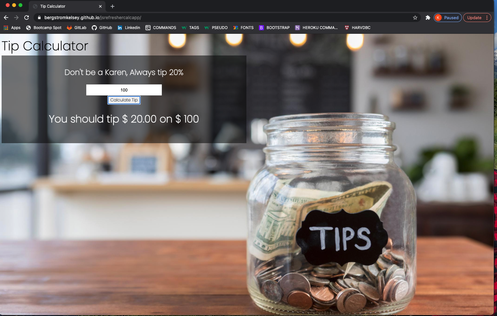

# jsrefreshercalcapp

Refreshing myself with all material learned in the University of Minnesota Web Development Bootcamp, starting from square one. 
A simple practice app, honing in on basic JavaScript knowledge and skill.
Calulate the correct tip amount, appreciate your server!

